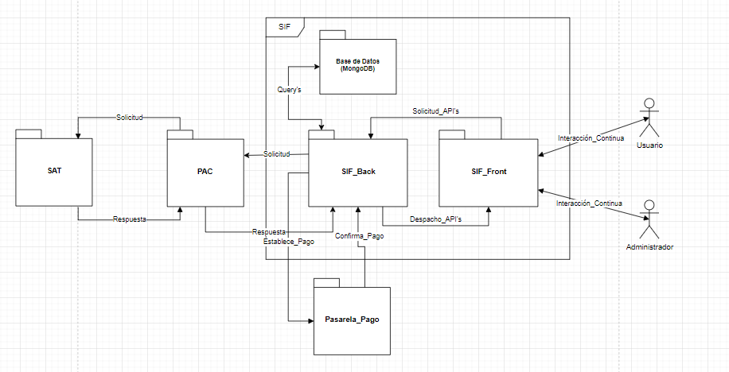

# Introduction

La presente documentación de especificaciones del servidor proporciona información detallada sobre las elecciones clave que hemos realizado para configurar nuestro entorno de servidor. Esta documentación es esencial para comprender las características, capacidades y configuraciones específicas de nuestro sistema, lo que nos permite gestionarlo de manera efectiva y optimizar su rendimiento.
## Arquitectura general del proyecto

#### Diagrama general del proyecto

Por la complejidad del sistema, el código del proyecto se dividió en 3 sub-proyectos. La estructura general de los directorios quedó de la siguiente manera.